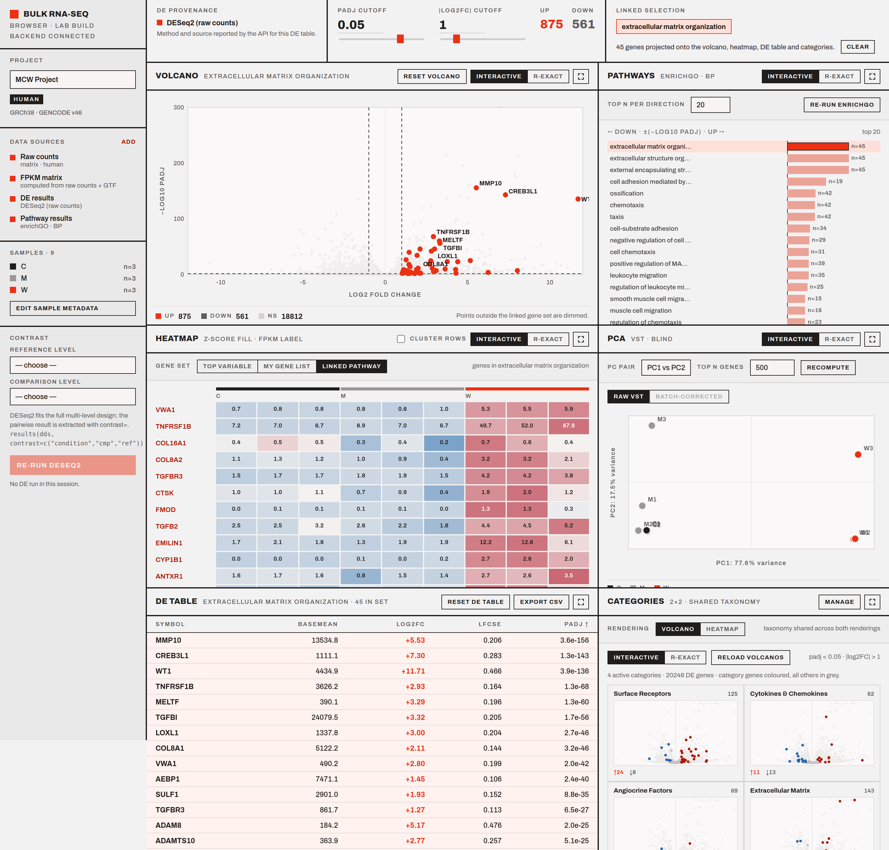
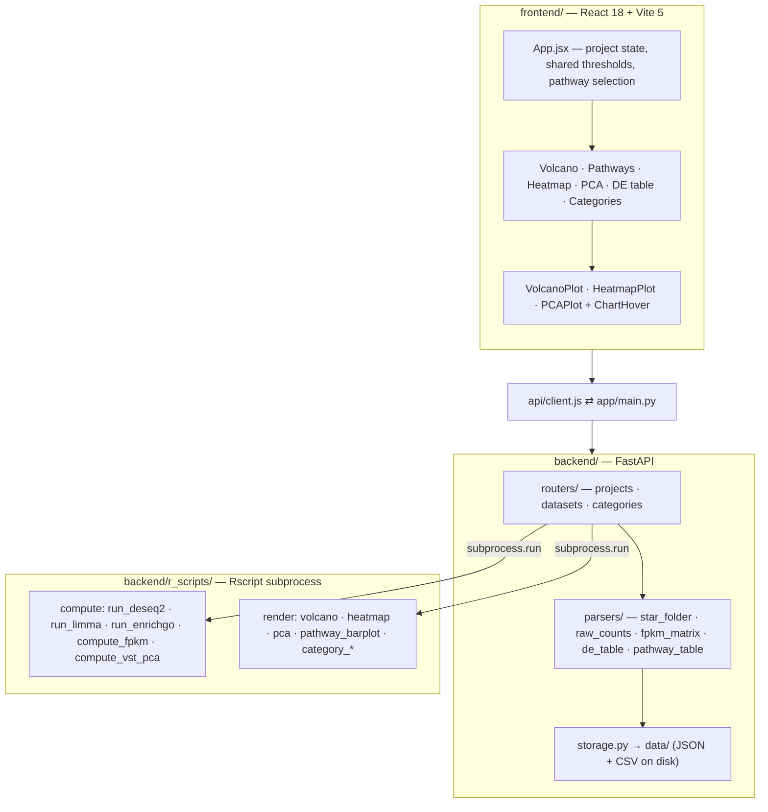

# Bulk RNA-seq Browser


An interactive analysis environment for exploring bulk RNA-seq experiments and
producing publication-ready figures from the same R/Bioconductor workflow the
analysis itself runs on.

Bulk RNA-seq results are usually scattered across count matrices,
differential-expression tables, pathway reports, heatmaps, and static PDFs.
Bulk RNA-seq Browser brings those materials into one linked workspace.
Researchers can import gene-level counts, STAR count folders, FPKM matrices, or
existing differential-expression and pathway results; the application computes
whichever analysis steps are missing; and six coordinated views — volcano,
pathways, heatmap, PCA, DE table, and gene categories — read from the same
project at once.

Its central design goal is the connection between exploration and
reproducibility. Interactive charts support rapid investigation, while every
major visualization can be re-rendered through an R-exact path that invokes the
same packages and plotting code used to produce the laboratory's published
figures.

**Current status:** Functional local research tool under active development.



<sub>All six panels over one project, with the GO term <em>extracellular matrix
organization</em> selected. The same 45 genes drive the volcano's labels, the
heatmap's rows, and the top of the DE table.</sub>

## Key capabilities

| Capability | What it provides |
|---|---|
| **Flexible inputs** | Gene-level count matrices, STAR `ReadsPerGene.out.tab` folders, FPKM matrices, existing DE tables, or existing pathway-enrichment results |
| **Integrated analysis** | Computes what is missing — FPKM from counts and a GENCODE GTF, differential expression, VST-based PCA, and GO enrichment |
| **Linked exploration** | A pathway selection propagates into the volcano, heatmap, and DE table, each responding differently and reversibly |
| **Reproducible figures** | Every interactive view is paired with an R-rendered counterpart driven by the same ggplot2/pheatmap code |
| **Method routing** | DESeq2 for count data, limma for FPKM-only projects — chosen from the data, never a user-facing dropdown |
| **Provenance** | Each project records whether its DE results were uploaded or computed, and by which method; the label stays visible above the panels |
| **Scale** | Interactive rendering and hover tested on a 63,140-gene result with no per-point listeners |

## Why this exists

Bulk RNA-seq interpretation tends to fragment. The differential-expression
result lives in one table, the pathway enrichment in another, the heatmap and
volcano in separate static PDFs, and the code that produced each in a one-off
script. Answering a question that spans them — *which genes drive this enriched
pathway, and where do they sit in the full result?* — becomes a manual
cross-reference between files that were never designed to be read together.

The inputs fragment too. Collaborating projects arrive with different
conventions: some provide a STAR count folder, some a gene-level count matrix,
some only an FPKM matrix, some a finished DE table written by an earlier script.
Each previously required knowing which upstream tool produced which column names
before anything could be plotted.

This application addresses both. It accepts the common starting points rather
than one rigid format, computes the analysis steps a given project is missing,
and presents the results as six views over a single project so a researcher can
move from a pathway-level finding to its contributing genes to their position in
the full DE result without leaving the screen or re-deriving anything.

It is explicitly not a replacement for the laboratory's R. DESeq2, limma,
clusterProfiler and the ggplot2/pheatmap renderers run as real R subprocesses,
because the statistical results and published figures should come from the
established tools rather than from a reimplementation.

## Linked exploration

Selecting a pathway is the application's central interaction, and it is
deliberately **not** a single shared filter. Three panels respond, each in the
way that panel's reading benefits from:

- **The volcano relabels.** Every point stays plotted and non-members are
  dimmed, so the pathway is read in the context of the whole result. The gene
  labels switch to the pathway's members while the user's own label
  configuration is preserved underneath and restored exactly by `Reset volcano`
  — including after a sequence of pathway switches.
- **The heatmap switches gene set.** Its selector moves to `Linked pathway` and
  re-fetches. A gene list the user had built is left untouched, and a manual
  switch away is not undone on the next render.
- **The DE table regroups.** No row is hidden. Members are lifted to the top of
  the *entire* sorted result rather than the visible page, so a member far down
  the table still surfaces, and the active column sort is preserved within both
  groups.

The Categories panel deliberately does not participate: it is a fixed comparison
frame, and a selection-dependent reference frame would not be one. This is
enforced by a test asserting its markup is byte-identical before and after a
selection.

Full per-panel mechanics, including the reset semantics and the reasoning behind
each choice, are in **[docs/linked-exploration.md](docs/linked-exploration.md)**.

## Interactive and R-exact figures

Every figure panel carries an `Interactive` / `R-exact` toggle, and the two are
intentionally different code paths rather than one renderer in two modes.

**Interactive** views are hand-written SVG. They respond live to the global padj
and |log2FC| controls, support hover inspection, and exist to make exploration
fast.

**R-exact** views run the corresponding `backend/r_scripts/render_*.R` through
`Rscript` and return the PNG and PDF that R actually drew — the same ggplot2 and
pheatmap code, producing the artifact that goes into a report or a manuscript.

Separating them is what lets the interactive layer take liberties for the sake of
responsiveness — decimated label placement, dimming, live threshold updates —
without any risk that those liberties reach an exported figure. The pathway
label override, for instance, never propagates to the R render: `Generate R plot`
sends the user's configured labels, never the selected pathway's members.

## Example workflow

**1. Create a project.** Attach whatever the experiment has: a count matrix, a
STAR output folder, an FPKM matrix, a DE table, a pathway table, or several at
once. Counts and FPKM also require a species, which resolves the GENCODE GTF used
for FPKM and gene symbols and the `org.*.eg.db` package used for enrichment. Each
input is parsed, its columns normalized, and a capability flag recorded.

**2. Confirm sample metadata.** Condition and batch per sample. Conditions are
pre-suggested by stripping a trailing `_N` replicate suffix from sample names and
flagged as inferred; the suggestion is always editable.

**3. Choose a contrast.** Pick reference and comparison levels. The statistical
method follows the data — DESeq2 when counts exist, limma when only FPKM does.
DESeq2 fits the full multi-level design once and extracts the pairwise result
with `results(dds, contrast = ...)`, so every contrast from one project shares
pooled dispersion estimates.

**4. Read the six panels.** The padj and |log2FC| controls in the status strip are
global: moving one re-derives the significant-gene counts and re-colors the
volcano, DE table, and category volcanos together, so a threshold means the same
thing everywhere on screen.

**5. Follow a pathway across panels.** Selecting an enriched GO term projects its
member genes into the volcano, heatmap, and DE table simultaneously.

**6. Expand and export.** Any panel opens full-size with live hover tooltips.
Switching it to `R-exact` runs the R renderer and returns the publication figure.

## Analysis methods and assumptions

The application makes several methodological choices that affect results, and
they are documented rather than implied.

Gene length for FPKM comes from the count matrix's own `Length` column when
present and otherwise from **union exon length** computed from the GENCODE GTF —
both conventions occur in real projects and disagree, so the app reproduces
whichever the input carries. DE method routing is automatic: **DESeq2** on counts,
**limma on log2(FPKM+1)** when only FPKM exists. Batch enters the DE design
formula as a covariate when present, and separately drives a
`limma::removeBatchEffect` correction in the PCA display only — the corrected
matrix never feeds DE. GO enrichment runs **separately for up- and
down-regulated genes**, against a universe of the genes actually tested in that
experiment rather than the whole genome, with Benjamini–Hochberg correction
applied independently of the DE correction. This application applies **no
low-count pre-filter** of its own; DESeq2's built-in independent filtering still
operates inside `results()`.

The FPKM-only limma route is a fallback, not an equivalent: it fits a normal
linear model to log-transformed FPKM rather than modeling counts with a
negative-binomial mean–variance relationship, uses no `voom` precision weights,
and inherits FPKM's lack of a cross-sample composition correction. Results from
that route are labelled `limma (FPKM-only)` wherever they appear.

Full detail — identifier and duplicate handling, missing-value propagation,
sample reconciliation, exact parameters, and known edge cases — is in
**[docs/methods.md](docs/methods.md)**.

## Quickstart

Both processes run at the same time.

**Backend**

```bash
cd backend
pip install -r requirements.txt
uvicorn app.main:app --host 0.0.0.0 --port 8000
```

**Frontend** (second terminal)

```bash
cd frontend
npm install
npm run dev -- --host
```

Vite serves on `http://localhost:5173`. The frontend defaults to the backend on
port 8000 of the host that served the page; set `VITE_API_BASE` to point
elsewhere.

**Requirements**

- Python 3.12 (developed against 3.12.2)
- Node 18+ (developed against 18.19.1 / npm 9.2.0; Vite 5 requires Node 18+)
- R with the Bioconductor stack below, reachable either as a conda environment
  named `r-env` or as `Rscript` on `PATH`

```
DESeq2  limma  clusterProfiler  AnnotationDbi  org.Hs.eg.db  org.Mm.eg.db
pheatmap  ggplot2  ggrepel  patchwork  RColorBrewer  scales  grid
dplyr  readr  tidyverse  jsonlite
```

FPKM computation and symbol mapping need a GENCODE GTF — human v46 (GRCh38) or
mouse vM35 (GRCm39).

**Configuration**

| Variable | Purpose | Default |
|---|---|---|
| `VITE_API_BASE` | Backend base URL used by the frontend build | `http://<page host>:8000` |
| `BULKRNASEQ_GTF_HUMAN` | Human GENCODE GTF path | the development machine's path |
| `BULKRNASEQ_GTF_MOUSE` | Mouse GENCODE GTF path | the development machine's path |
| `BULKRNASEQ_R_ENV` | Conda environment holding the Bioconductor stack | `r-env` |

STAR is **not** a runtime dependency. The application reads STAR's gene-count
output format; it does not run the aligner and does not accept FASTQ or BAM.

Project data is written to `data/` at the repository root as JSON and CSV. There
is no database.

## Architecture



Four engineering decisions worth calling out, because each was a trade-off rather
than a default:

**Charts are hand-written SVG, not a charting library.** The interface specifies a
flat, zero-radius, single-accent geometry that Plotly's chrome resisted at every
turn, so the three Plotly charts were rewritten as plain SVG. Measured in this
repository: the last Plotly-based commit builds to a **4,971.51 kB** JavaScript
bundle; the current build is **247.78 kB** (74.46 kB gzipped) — roughly a 20×
reduction alongside the removal of the application's only heavyweight dependency.

**Hover scales without per-point listeners.** The primary validation project
carries 63,140 genes, and attaching a mouse handler per mark at that scale is
visibly slow. `ChartHover.jsx` instead runs exactly one `pointermove` listener per
chart and resolves the point under the cursor by nearest-neighbour lookup against
a uniform spatial bucket grid, rebuilt once per data change. Charts hold their
`<svg>` in a `useMemo`, so hover state changes never re-render the point geometry.

**R runs as a subprocess rather than being ported to Python.** DESeq2 and limma
are invoked through `Rscript`, not reimplemented with pydeseq2 or equivalent,
because the reference results and published figures were produced by these
packages and a parallel implementation would introduce discrepancies with no
scientific benefit.

**Panels missing an input explain themselves.** A panel that cannot render shows a
ghosted skeleton, a reason generated from the project's live capability flags, and
a button that navigates to the fix — rather than appearing empty, silently
disabled, or, worse, rendering a kicker that describes a transform which never
ran.

## Testing and validation

The application invokes the same R packages and rendering code used by the
laboratory workflow, reducing discrepancies between interactive exploration and
exported results. End-to-end parity has currently been validated on one primary
project.

- **Backend:** 10 parser tests (`cd backend && pip install -r requirements-dev.txt && python -m pytest`).
- **Browser:** three Playwright suites in `frontend/validation/` drive the real
  dashboard against the real backend. They cover cross-panel pathway
  propagation, volcano reset semantics across multi-pathway switch sequences,
  and recovery from a dropped backend. They are not part of the build; see
  `frontend/validation/README.md` for how to run them out of tree.
- **Primary validation project:** raw counts + computed FPKM + DESeq2 DE +
  enrichGO pathways, 63,140 genes, 9 samples across 3 conditions.

## Current limitations

- **Cross-project validation is in progress.** End-to-end validation currently
  centers on one primary project. Other projects exercise individual entry
  points rather than the full path.
- **Projects without replication are not supported.** Both matrix parsers require
  at least two sample columns, and grouped rendering requires at least two
  conditions with more than one sample each. An n=1 project degrades rather than
  failing cleanly.
- **A single non-empty batch level breaks the DESeq2 run.** If every sample shares
  one batch label, the design branches to `~ batch + condition` and R fails on a
  one-level factor. The limma path guards against this; the DESeq2 path does not.
  Documented in [docs/methods.md](docs/methods.md).
- **Test coverage is uneven.** Browser coverage of the linked-selection behaviour
  is thorough; backend coverage is 10 tests over one parser. Python dependencies
  are unpinned.
- **Not packaged for deployment.** Environment variables now cover the GTF paths,
  the R environment name, and the API base URL, but there is no container image,
  no authentication, and no multi-user support. It runs as two local processes.

## Repository structure

```
bulkrnaseq-browser/
├── backend/
│   ├── app/
│   │   ├── main.py             FastAPI app, CORS, router mounting
│   │   ├── storage.py          project + dataset persistence under data/
│   │   ├── routers/            projects.py, datasets.py, categories.py
│   │   ├── parsers/            star_folder, raw_counts, fpkm_matrix,
│   │   │                       de_table, pathway_table
│   │   └── seed_data/          default gene category taxonomy
│   ├── r_scripts/              run_deseq2, run_limma, run_enrichgo,
│   │                           compute_fpkm, compute_vst_pca,
│   │                           render_volcano, render_heatmap, render_pca,
│   │                           render_pathway_barplot, render_category_*
│   ├── tests/                  pytest — parser fixtures
│   ├── requirements.txt
│   └── requirements-dev.txt
├── frontend/
│   ├── src/
│   │   ├── App.jsx             dashboard shell, shared thresholds + selection
│   │   ├── index.css           design tokens — color, type, rule weights
│   │   ├── api/client.js       every backend call, one module
│   │   └── components/         panel sections, SVG plots, ChartHover, ui.jsx
│   ├── validation/             Playwright suites (not part of the build)
│   ├── vite.config.js
│   └── package.json
├── docs/
│   ├── methods.md              analysis methods and assumptions
│   ├── linked-exploration.md   per-panel behavior of a pathway selection
│   └── screenshot.png
└── data/                       runtime project storage (gitignored)
```

## Author

Ryan Nachman — Weill Cornell Medicine.

This project does not currently carry an open-source license.
