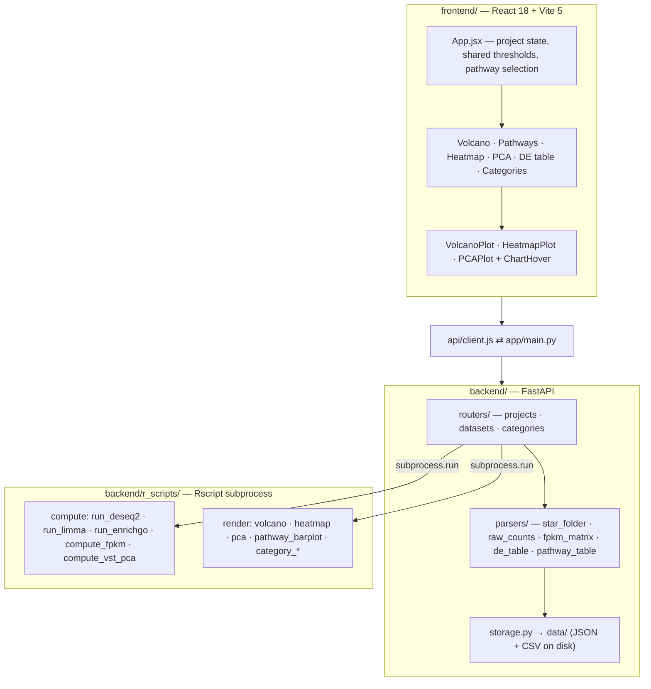

# Bulk RNA-seq Browser

*A single-screen dashboard for reading a bulk RNA-seq differential expression result — six linked panels over one project, with every interactive figure paired to the R render that actually produces the publication figure.*

**Status:** working local tool, in active use against real lab projects. Not packaged for deployment.


## Why this exists

The lab's bulk RNA-seq work arrives as finished analysis directories, one per
collaborator, each with slightly different conventions: some hand over a STAR
`*.ReadsPerGene.out.tab` folder, some a raw counts matrix, some only an FPKM
matrix, some a `DE_full_*.csv` that a DESeq2 script already wrote. Reading any
one of them meant opening an R session, remembering which script produced which
column names, and re-rendering a volcano to answer a question that took ten
seconds to ask.

The other half of the problem is that the *answers* were fragmented. A volcano
plot lives in one PDF, the pathway enrichment in another, the heatmap in a
third — so the question "which of these genes are the ECM ones, and where do
they sit on the volcano" was a manual cross-reference between three static
images. This app puts all six views on one screen over one project's data, and
makes the cross-reference a click.

It deliberately does not replace the lab's R. DESeq2, limma, clusterProfiler
and the ggplot2/pheatmap renders run as real R subprocesses against the same
packages the lab's own scripts use, so the numbers and the exported figures
agree with the established pipeline rather than approximating it.

## What this is

A FastAPI backend and a React frontend over a **project** — a named bundle of up
to four data sources (raw counts or a STAR output folder, an FPKM matrix, a DE
results table, a pathway enrichment table) plus per-sample condition and batch
metadata. Whatever is missing, the app computes: FPKM from raw counts and the
species GTF, DE from counts, pathway enrichment from DE.

The dashboard is one screen, no tabs — a fixed project rail on the left, a
status strip across the top, and a six-panel grid:

| Panel | What it shows |
|---|---|
| **Volcano** | log2FC × −log10 padj, labelled by top-N-per-direction or your own gene list |
| **Pathways** | clusterProfiler `enrichGO` biological-process terms, as a diverging up/down barplot |
| **Heatmap** | z-score fill over FPKM, for the top-variable genes, your gene list, or a linked pathway |
| **PCA** | sample clustering on a VST transform, raw or batch-corrected |
| **DE table** | the full sortable, exportable result table |
| **Categories** | a 2×2 of mini-volcanos or mini-heatmaps over four active gene categories |

Every figure panel carries an **Interactive / R-exact** toggle. Interactive is
the hand-rolled SVG chart — fast, hoverable, and it responds to the threshold
sliders live. R-exact runs the corresponding `r_scripts/render_*.R` through
`Rscript` and shows you the PNG that R actually drew. The two are deliberately
not the same code path: the interactive plot is for exploring, the R render is
for the figure that goes in the paper.

### The linking, which is the point

Click a bar in the Pathways panel and its gene set is projected across the
dashboard at once. What makes it worth building is that the three panels
respond *differently*, each in the way that panel's own reading actually
benefits from — not one shared "filter to these genes":

**The volcano relabels.** Every point stays plotted; genes outside the set are
dimmed, and the gene labels are replaced by the pathway's members. The
label configuration underneath (Top N, or your own list) is untouched — so the
override is presentational only, a `Reset volcano` button restores the exact
label set you had, and the R-exact render keeps printing your configured labels,
never the pathway's.

**The heatmap re-fetches.** Its gene-set selector auto-switches to `Linked
pathway` and the rows become the pathway's genes. A gene list you had typed into
`My gene list` survives untouched, and switching back to it manually is not
undone on the next re-render.

**The DE table regroups.** No row is hidden. Members are lifted to the top of
the *entire* sorted result — not just the visible page — and non-members are
dimmed in place, so a member 40,000 rows down still surfaces. Re-sorting on any
column re-sorts both groups and keeps the grouping; `Reset DE table` collapses
it back to one flat sort.

The Categories panel deliberately does *not* participate: its taxonomy is a
fixed comparison frame, and letting a pathway selection dim it would make the
2×2 mean something different from one moment to the next.

## Highlights

- **Hand-rolled SVG charts, not Plotly.** The design system specifies a
  zero-radius, flat, single-accent geometry that Plotly's chrome fights at every
  turn, so the three Plotly charts were rewritten as plain SVG. Measured on this
  repo: the last Plotly build produces a **4,971.51 kB** JS bundle; the current
  build produces **247.78 kB** (74.46 kB gzipped) — a 20× reduction, and the
  removal of the app's only heavyweight dependency.
- **Hover at full annotation scale.** The primary validation project carries
  **63,140 genes**. Attaching a listener per mark at that scale is visibly slow,
  so `ChartHover.jsx` runs exactly one `pointermove` listener per chart and finds
  the point under the cursor by nearest-neighbour lookup against a uniform bucket
  grid, rebuilt once per data change. Charts hold their `<svg>` in a `useMemo` so
  a hover never re-renders the 63,140-point path.
- **R by subprocess, for exact parity.** DE is run through DESeq2 and limma via
  `Rscript`, not pydeseq2 — the lab's historical results were produced by these
  packages, and a Python reimplementation would silently disagree at the fourth
  decimal. Same reasoning for the renders: ggplot2 and pheatmap draw them.
- **DE method routing is automatic, never a user-facing choice.** Raw counts
  present means DESeq2 on the counts; FPKM only means limma on log2(FPKM+1).
  There is no dropdown, because picking wrong is a statistics error, not a
  preference.
- **Provenance is persistent, not incidental.** Every project records how its DE
  table came to exist — `uploaded`, `DESeq2 (raw counts)`, or `limma
  (FPKM-only)` — and the status strip shows it above the panels for as long as
  the project is open.
- **Locked panels explain themselves.** A panel with no data to draw renders a
  ghosted skeleton, a reason generated from the project's live capability flags,
  and a button that goes to the fix — not an empty box.

## Architecture at a glance



## How it works

**1. Start a project.** From the entrance screen you name a project and attach
whatever you have: an FPKM matrix, a DE results table, a pathway results table, a
raw counts matrix, or a flat STAR output folder of `*.ReadsPerGene.out.tab`
files. Raw counts and FPKM also need a species — human or mouse — because that
resolves both the GTF used to compute FPKM and the OrgDb used later by pathway
enrichment. The backend parses each file, normalises the column names it
recognises, and records a capability flag per data source.

**2. Fill in the sample metadata.** Condition and batch per sample, in an
editable table; condition groups are pre-guessed from the trailing `_N`
replicate suffix in the sample names, which is right often enough to be worth
offering and easy enough to correct when it isn't.

**3. Pick a contrast and run.** Choose a reference level and a comparison level
in the rail and hit run. The method is decided for you from what the project
carries. DESeq2 fits the full multi-level design and the pairwise result is
extracted with `contrast=`, rather than re-fitting per pair; batch enters the
design formula when the metadata has more than one batch.

**4. The six panels populate.** Each renders from the project's own data as soon
as its inputs exist. The status strip's padj and |log2FC| sliders are global —
moving one re-derives the up/down counts and re-colours the volcano, the DE table
and the category volcanos together, because a threshold that means one thing in
one panel and another thing in the next is worse than no threshold at all.

**5. Click a pathway to cross-link.** Selecting a bar in the Pathways panel
projects its gene set onto the volcano, heatmap and DE table simultaneously, each
in its own way — the three behaviours described above. Escape, or the status
strip's `Clear`, drops the selection; each panel's individual reset button drops
only that panel's response and leaves the other two linked.

**6. Expand a panel for the real look.** Any panel opens to a modal over a scrim
at full size, state preserved, with hover tooltips live on the interactive
charts. Flip to `R-exact` there and the panel runs the R renderer and hands you
the PNG and PDF that R drew — the figure, not an approximation of it.

## Prerequisites

- **Python 3.12** (developed against 3.12.2)
- **Node 18+** (developed against 18.19.1 / npm 9.2.0; Vite 5 requires 18+)
- **R**, reachable either as a conda environment named `r-env` or as a bare
  `Rscript` on `PATH`. The backend prefers `conda run --no-capture-output -n
  r-env Rscript` and falls back to `Rscript`.

R packages actually invoked by `backend/r_scripts/`:

```
DESeq2  limma  clusterProfiler  AnnotationDbi  org.Hs.eg.db  org.Mm.eg.db
pheatmap  ggplot2  ggrepel  patchwork  RColorBrewer  scales  grid
dplyr  readr  tidyverse  jsonlite
```

A GENCODE GTF is needed to compute FPKM from raw counts — human v46 (GRCh38) and
mouse vM35 (GRCm39). Its location is currently hardcoded for the lab's single
deployment machine in `backend/app/routers/projects.py`; making it configurable
is a small change and an open item below. STAR itself is *not* a runtime
dependency — the app only reads STAR's output format, it never runs the aligner.

## Quickstart

Both halves must run at the same time; the frontend has the backend's base URL
hardcoded in `frontend/src/api/client.js`.

Backend:

```bash
cd backend
pip install -r requirements.txt
uvicorn app.main:app --host 0.0.0.0 --port 8000
```

Frontend, in a second terminal:

```bash
cd frontend
npm install
npm run dev -- --host
```

Vite serves on `http://localhost:5173`. Project data is written to `data/` at the
repo root, which is gitignored — nothing about a project lives in the database
sense, it's JSON and CSV on disk.

Backend tests (10 parser tests; `pytest` is not in `requirements.txt`, so
install it first):

```bash
cd backend && pip install pytest && python -m pytest
```

The three Playwright suites under `frontend/validation/` drive the real
dashboard against the real backend and are not part of the build; see
`frontend/validation/README.md` for how to run them out of tree.

## Repository layout

```
bulkrnaseq-browser/
├── backend/
│   ├── app/
│   │   ├── main.py             FastAPI app, CORS, router mounting
│   │   ├── storage.py          project + dataset persistence under data/
│   │   ├── routers/            projects.py, datasets.py, categories.py
│   │   ├── parsers/            star_folder, raw_counts, fpkm_matrix,
│   │   │                       de_table, pathway_table
│   │   └── seed_data/          default gene category taxonomy
│   ├── r_scripts/              run_deseq2, run_limma, run_enrichgo,
│   │                           compute_fpkm, compute_vst_pca,
│   │                           render_volcano, render_heatmap, render_pca,
│   │                           render_pathway_barplot, render_category_*
│   ├── tests/                  pytest — parser fixtures
│   └── requirements.txt
├── frontend/
│   ├── src/
│   │   ├── App.jsx             dashboard shell, shared thresholds + selection
│   │   ├── index.css           the design system — colour, type, rules
│   │   ├── api/client.js       every backend call, one module
│   │   └── components/         panel sections, SVG plots, ChartHover, ui.jsx
│   ├── validation/             Playwright suites (not part of the build)
│   ├── vite.config.js
│   └── package.json
├── docs/screenshot.png
└── data/                       runtime project storage (gitignored)
```

## Status

- **Single-sample groups aren't supported by any panel.** Grouping and
  colour-banding require at least two conditions with more than one sample each
  (`n_groups >= 2 && n_groups < n_samples`), and DESeq2 needs replicates. An n=1
  project currently degrades rather than failing cleanly.
- **Cross-project validation is still in progress.** One project — raw counts +
  computed FPKM + DESeq2 DE + enrichGO pathways, 63,140 genes, 9 samples across 3
  conditions — is verified end to end against the lab's own R output and is what
  the Playwright suites drive. The other projects in the working set exercise
  individual entry points, not the whole path.
- **Deployment-machine assumptions are hardcoded.** The GENCODE GTF paths, the
  `r-env` conda environment name, and the backend base URL in the frontend client
  are all fixed values rather than configuration. Fine for one workstation, the
  first thing to change for a second.
- **`plotly.js` is still listed in `package.json`.** Nothing in `src/` imports it
  since the SVG rewrite; it is dead weight in `node_modules` and should be
  removed from the dependency list.
- **Test coverage is uneven.** The Playwright suites cover the cross-panel
  linking behaviour thoroughly; backend coverage is 10 tests over one parser.

## Author

Ryan Nachman — Weill Cornell Medicine.

This project does not currently carry an open-source license.
